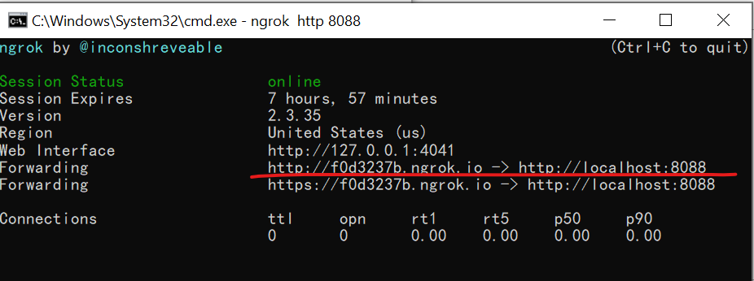
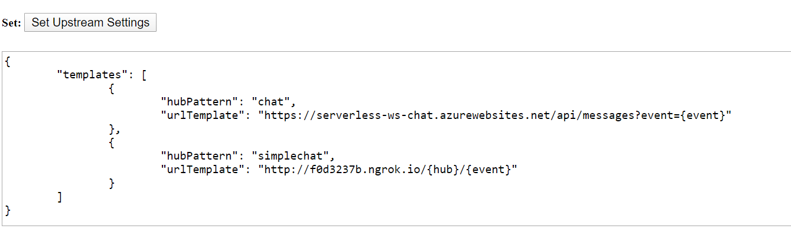
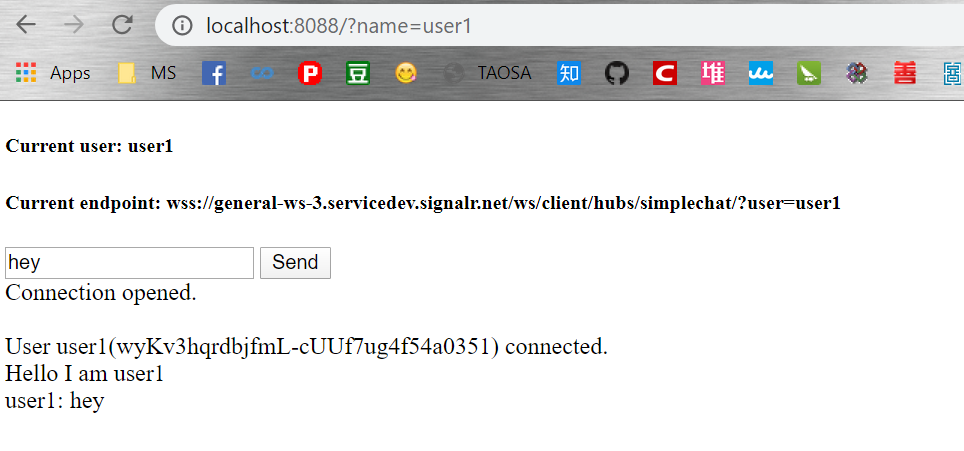

# A Simple Chat on WebSocket
This is a simple chat demo. The client side uses the `WebSocket` Web API and is connected to Azure SignalR Serverless WebSocket acting as a reverse proxy. There is no need for the server side to be a WebSocket server, the server side, hosted in [node.js](), only need to handle bussiness logic.

## Run the demo locally
### Prerequisites
* [Node.js]() to host your server locally
* [ngrok](https://ngrok.com/) to expose local port to public

### Steps
1. Update `AzureSignalRConnectionString` in [settings.json](./settings.json) with your connection string.
2. Under this folder, run the local server by:
```
npm install
node index.js
```
The local server now listens the `8088` port.

3. Expose the local port using [ngrok](https://ngrok.com/)
Go to the path where `ngrok` exists, type:
```
ngrok http 8088
```
Now local server has a public host name `xxxxx.ngrok.io`. As in the below screenshot, the public host name is `http://f0d3237b.ngrok.io`.



4. Set the Upstream pattern for your service
We have the [Upstream Manage Page](https://ws-manage.azurewebsites.net/api/manage) as a **temp** workaround before the Upstream settings are available in the Azure portal.

Open the [page](https://ws-manage.azurewebsites.net/api/manage) and input your `ConnectionString`, set the upstream for hub `simplechat` to the textarea for **Set Upstream Settings**, remember to replace `xxxxx` with your `ngrok` host. Our sample server listens to path `/simplechat/connect`, `/simplechat/disconnect` and `/simplechat/message`, from which `simplechat` is the value of the `hub`, and `connect`, `disconnect` and `message` are the name of the events. For details about the terms, please refer to the [spec](../../specs/runtime-websocket-serverless.md).

```json
{
	"templates": [
		{
			"hubPattern": "simplechat",
			"urlTemplate": "http://xxxxx.ngrok.io/{hub}/{event}"
		}
	]
}
```

For example, the below screenshot sets the upstream templates for both `chat` and `simplechat` hubs.


5. Visit the chat
Now it is all set, visit the client page `http://localhost:8088?name={user_name}` with your `{user_name}` to try the Chat.


>>>>>>> fdb9a47... Add simple chat demo
