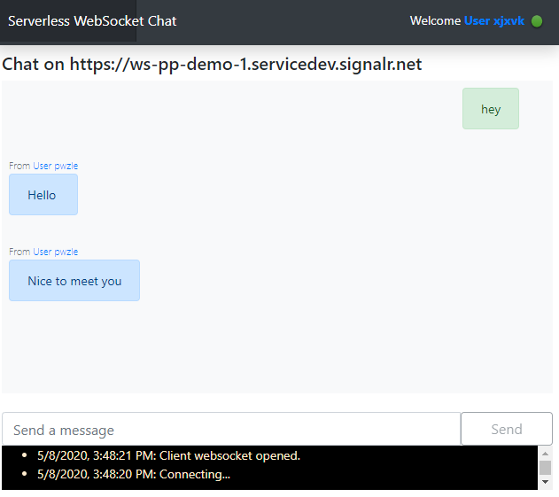
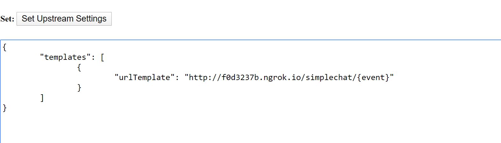

# A Simple Chat on WebSocket
This is the server side of the simple chat demo hosted by [Express](http://expressjs.com/). 

Follow the steps described below to run the [chat demo](https://wssimplechatdemo.z13.web.core.windows.net/) towards your own endpoint.



## Setup your own demo within 4 steps
### Prerequisites
* [Node.js v12 or later](https://nodejs.org/) to host your server locally
* [ngrok](https://ngrok.com/) to expose local port to public

### Step1. Configure application settings
Update `AzureSignalRConnectionString` in [settings.json](./settings.json) with your connection string.

### Step2. Run the app locally
2. Under current folder, run the local server by:
```
npm install
node main.js
```
The local server now listens the `8088` port.

### Step3. Expose the local Upstream
[ngrok](https://ngrok.com/) helps us to expose local ports.

Go to the path where `ngrok` exists, type:
```
ngrok http 8088
```

From now on, **ngrok** forwards every request to `http://(id).ngrok.io` to `http://localhost:8088`.

For example, the below **ngrok** exposes localhost port 8088 to an URL as `http://f0d3237b.ngrok.io`.


### Step4. Set the Upstream pattern for your Service

Now it is time to config the Upstream URL pattern inside the Service.

With this Private Preview version, we provide an [Upstream Manage Page](https://ws-manage.azurewebsites.net/api/manage) for you to set and get the Upstream settings of the Service. Please note that this is a **temp** workaround before the Upstream settings are available in the Azure portal.

Open the [page](https://ws-manage.azurewebsites.net/api/manage) and input your `ConnectionString`, set the upstream to the textarea for **Set Upstream Settings**, remember to replace `(id)` with your `ngrok` host. Our sample server listens to path `/simplechat/connect`, `/simplechat/disconnect` and `/simplechat/message`, from which `connect`, `disconnect` and `message` are the name of the events. For details about the terms, please refer to the [spec](../../specs/runtime-websocket-serverless.md).

```json
{
	"templates": [
		{
			"urlTemplate": "http://(id).ngrok.io/simplechat/{event}"
		}
	]
}
```

For example, the below screenshot sets the upstream templates as `http://f0d3237b.ngrok.io/simplechat/{event}`.


### Visit the chat
Now it is all set, visit the page https://wssimplechatdemo.z13.web.core.windows.net/, type your own **Endpoint** and *Continue* to start your own chat.


